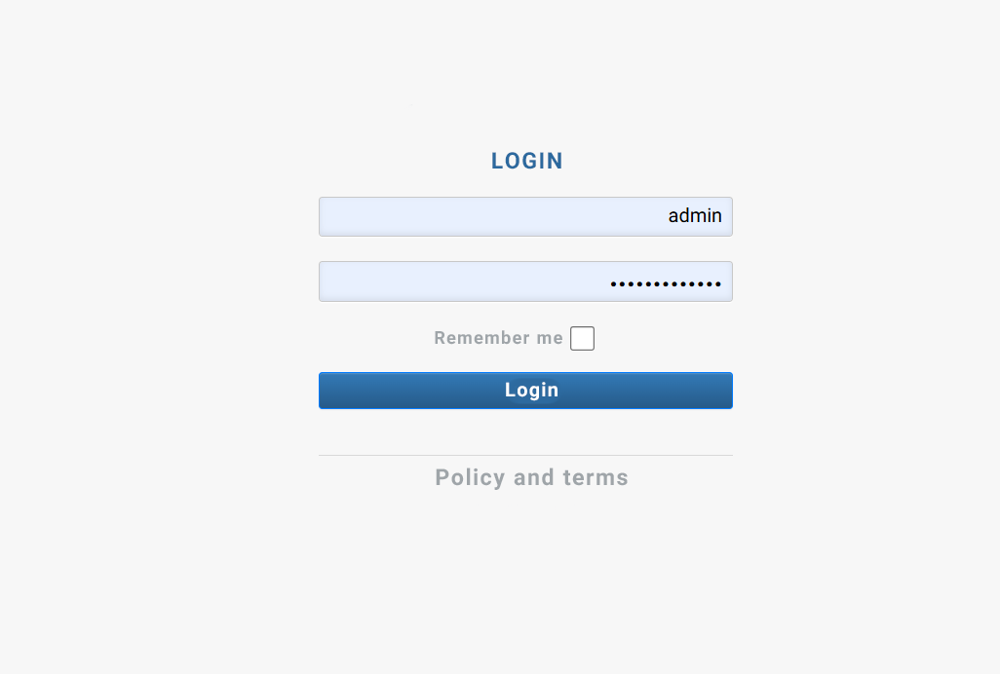
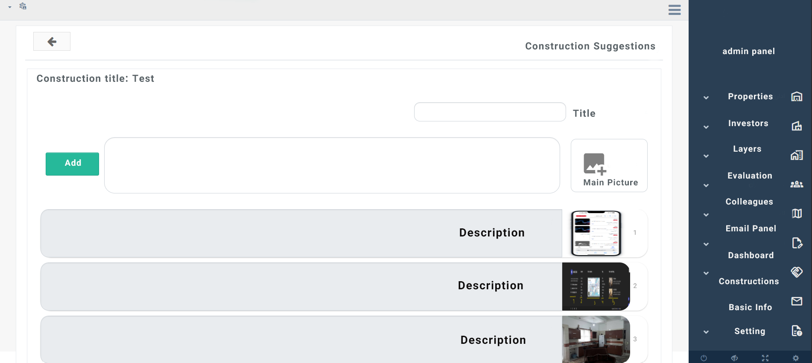
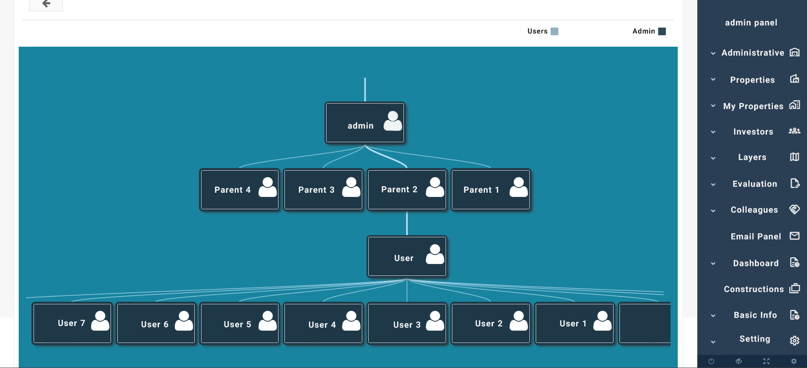

# 🛠️ Brikta Admin Panel

A centralized dashboard for managing all content, users, and operations across the **Brikta** real estate ecosystem.

---

## 📸 Screenshots






---

## 🔍 Features

- 🔐 Admin authentication with role-based access
- 🏘️ Full management of users, properties, and investment records
- 📊 Visual dashboard with real-time charts and insights
- 📝 Complete CRUD operations for property listings

---

## 🧰 Tech Stack

- C# / ASP.NET MVC
- JavaScript + jQuery
- Bootstrap + TailwindCSS
- SQL Server

---

## ⚙️ Requirements

- Visual Studio 2019 or higher
- .NET Framework 4.7.2 or higher
- SQL Server (local or remote instance)
- Proper connection strings configured in `appsettings.json`

---

## 🚀 How to Run

```bash
# 1. Clone the repository
git clone https://github.com/codebanoo/brikta-admin-panel.git

# 2. Open the solution file (.sln) in Visual Studio

# 3. Restore NuGet packages (if not automatically)

# 4. Update the connection string in appsettings.json if needed

# 5. Build and run the project (Ctrl + F5)
